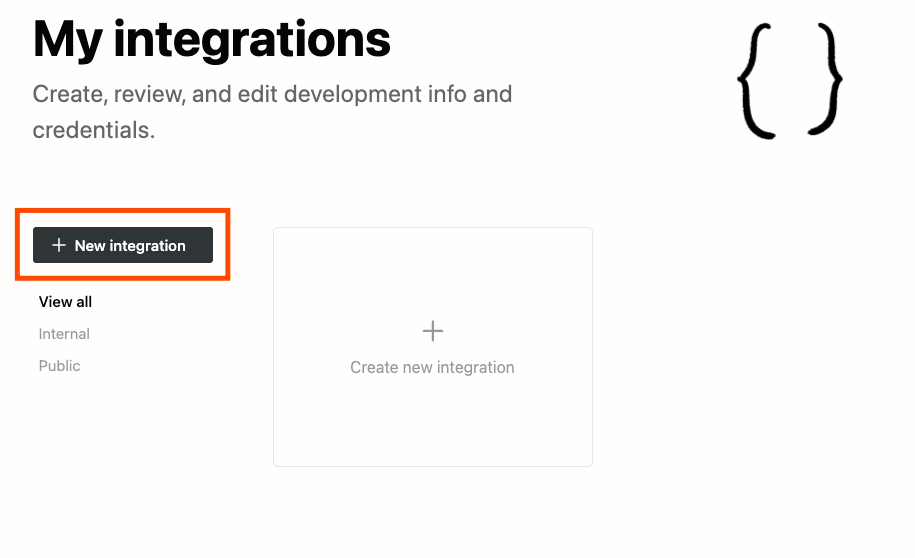
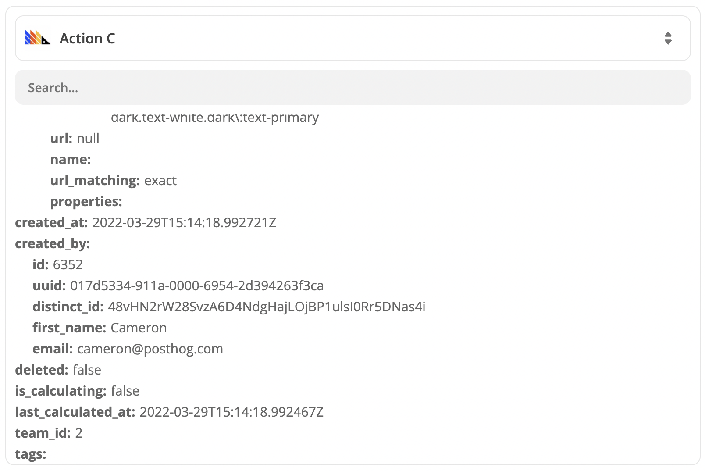

As large organizations get started with PostHog, the number of custom actions you’re tracking can start to grow very quickly. This can become an organizational challenge for teams where multiple people are creating actions, often with different naming conventions. 

PostHog’s Data Management suite exists to help deal with this challenge, providing a way to clarify action ownership, reduce noise and help teams collaborate. However, you may want to maintain a list of tracked actions outside of the Data Management suite for users who do not have access to PostHog.

In this tutorial, we’ll explain how to use PostHog’s Zapier plugin to connect with Notion and maintain a database of which actions are being tracked outside of the Data Management suite. 

> Not using Notion? It’s possible to use the Zapier plugin to connect PostHog to a variety of platforms, including Confluence or Google Sheets. 

## Step 1: Connect Zapier to PostHog 

First, head to the [‘My Apps’ section of your Zapier account](https://zapier.com/app/connections) and click ‘Add Connection’. Search for ‘PostHog’ and follow the instructions to connect your PostHog instance to Zapier. You’ll need to be logged in to PostHog to do this. 

## Step 2: Create a Zapier bot in Notion

Next, we need to create a Zapier bot in Notion, which will perform the action of updating a database with information whenever an action is defined in PostHog. You’ll need to be a Notion admin to do this. 

Start by heading to Notion’s Settings page, then click the Integrations tab and select ‘Develop your own integrations’ to start creating your bot. Here you can follow the instructions to give your bot a name, as well as customize it in other ways. You can even grab the PostHog logo from [our brand assets](/handbook/company/brand-assets) and use it as the icon for your bot!

Once you’ve named and created your bot, you’ll need its secret to connect it to Zapier. Find this under the Secrets tab and copy it to a safe place temporarily.

## Step 3: Connect Notion to Zapier

Head back to the [‘My Apps’ section of your Zapier account](https://zapier.com/app/connections) and follow the instructions to connect Zapier to Notion. You’ll need to be signed in to Notion and have access to the secret you copied earlier. 

Finally, you’ll need to create a database in Notion and invite your previously created Notion bot so that it has edit access to the page. Without this, the bot will be unable to write new database entries to Notion. 

## Step 4: Create your workflow

PostHog’s integration with Zapier enables you to create workflows, or Zaps, from a variety of triggers. We want to maintain a list of actions, so in this tutorial we’ll use ‘Action Defined’ as a trigger. This means that the workflow will be completed whenever a new action is created in PostHog.

The Zapier editor will guide you through the process of creating the workflow, including running a test to ensure it is connected to the correct account. Doing so, you’ll be able to see what information can be written to a Notion database. This includes: 

- The date and time the action was defined
- Who defined the action
- The name of the defined action
- A description of the action, if this has been defined by the creator

If the action is specific to a page or on-page selector, this information is also included. 

As an output, we want the workflow to populate the information to a Notion page — so we’ll use Notion’s ‘Write to database’ output. With these options created you can tailor how the information contained in the event is written to your Notion database. Instituting best practices, such as requiring action creators to include descriptions for their actions, will enable you to track all tracked actions within a simple Notion table. 
